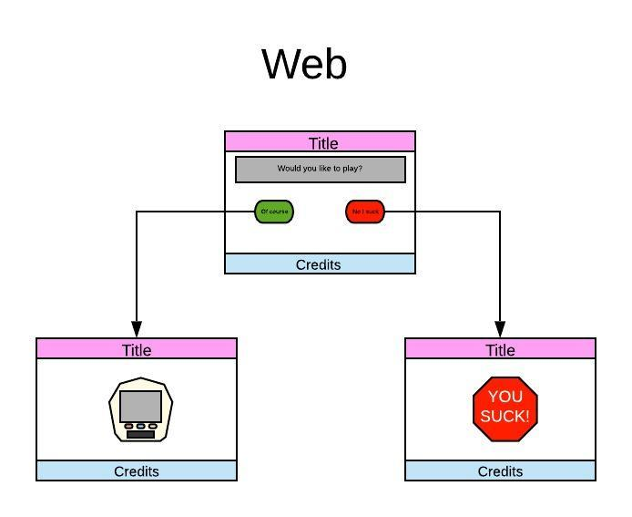
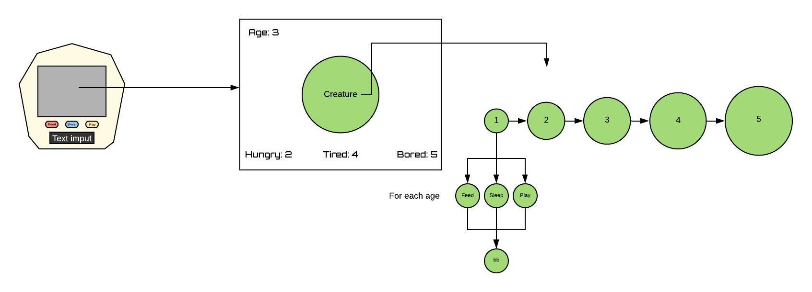
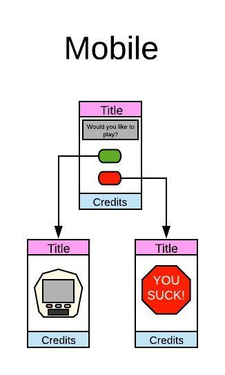

# Tamagotchi
Unit One Game Project
---

## Overview
This project was created as part of the ciriculum for General Assembly's Software Engeneering Imersive program. The main goal of the project is to build my version of a Tamagotchi game. It is the file structure and all documents including: HTML , CSS, and JavaScript files were cerated by me. Images will be cited at the end.
---

## Link to game
WWW.linktomygame.com
---

## Wireframes

### Web verson is in development 

---
## User Stories

* The user loads the main screen with a prompt to continue with two options.
    * If the user selects no they are scolded.
    * If the user selects yes the game console appears.
* The game console will have a main display and 3 buttons with an input field.
* The user will be prompted to give their new pet a name and click a button to start the game. 
* Once the game begins:
    * The game will start a timer.
    * The timer will update stats of the Tamagotchi pet at different intervals.
        * The pet will have:
            * Hunger
            * Bored
            * Tired
            * Age
            * Each will start at 0
        * The user will try to keep the pet from dying by clicking the 3 buttons that will proform functions.
            * The feed button will decrease the hunger stat.
            * The sleep button will decrease the tired stat.
            * The play button will decrease the bored stat.
        * If any one of the stats gets above 10 the pet will die.
        * If the Characters age reaches 6 the user wins.
* **The point of the game is to keep you pet alive until it reaches age 6.**
---

## Credits
Photo by Ray Hennessy @ https://unsplash.com/@rayhennessy?utm_source=unsplash&amp;utm_medium=referral&amp;utm_content=creditCopyText"

Photo by Kevin Wenning https://unsplash.com/@kevinwenning?utm_source=unsplash&amp;utm_medium=referral&amp;utm_content=creditCopyText